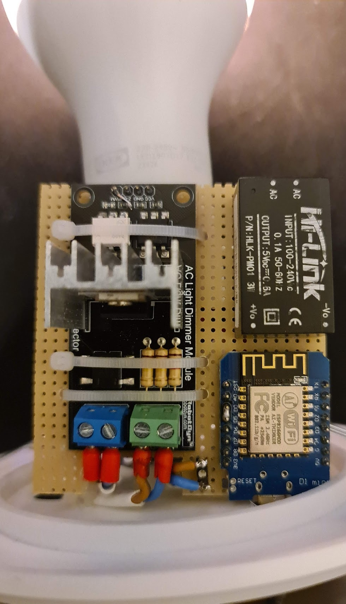

# Alarm clock lamp

Project consisting of lighting a lamp progressively until the time of waking up in the morning

## Hardware

* Wemos D1 mini
* AC light dimer module
* Hi-Link HLK-PM01

## Wemos

the code of the wemos has a web server that will receive the time to turn on the light and the time to turn it on

### Installation

1. Driver : https://www.wemos.cc/en/latest/ch340_driver.html
2. Arduino->File->Preferences->Additional Boards Manager URLs : http://arduino.esp8266.com/stable/package_esp8266com_index.json
3. Sketch->Include Library->Manage Libraries->Search : `ESP8266 Microgear`
4. Install `ESP8266 Microgear` from `Chavee Issariyapat` version 1.2.4
5. Sketch->Include Library->Manage Libraries->Search : `NTPClient`
6. Install `NTPClient` from `Fabrice Weinberg` version 3.2.0
7. Tools->Board->Boards Manager->search : `ESP8266` and Install
8. Tools->Boards->WeMos D1 R2 & Mini

## Android

The Android application allows to get automatically the time of the next alarm clock and to define the time of switching on. A button allows to send this data to Wemos.

